# Книга здоровья

Дневник здоровья, лекарства и процедуры — в одном окне.
Приложение-страница, которое ставится на телефон или компьютер и работает без интернета.


<a href="https://zubakamaraka.github.io/health_book/"></a>

Ничего устанавливать не обязательно — открывается прямо в браузере.

---

Приложение сделано для пожилых родителей. Главный экран отвечает на один вопрос:
**что принимать сегодня и принято ли уже.** Отметка приёма — одно нажатие крупной
кнопки. Весь интерфейс масштабируется кнопками «А−» и «А+» без потери чёткости.

Число задаётся тремя способами, чтобы ни один не оказался тупиком: кнопками «−» и «+»
с разгоном при удержании, протягиванием пальца по цифре (чем быстрее движение, тем
крупнее шаг) и обычным вводом с клавиатуры по нажатию на саму цифру. Подобрать «36,6»
и перескочить с 70 на 100 одинаково быстро.

- **назначения**: что, в какой дозе, с какой даты, для чего назначено и кем — с отметками приёма утром, днём, вечером и ночью
- **библиотека**: 273 лекарства и 37 процедур со справочными сведениями и более 600 торговых названий
- **поиск как в жизни**: набрали «Кетонал» — в списке крупно «Кетонал», а рядом «= Кетопрофен»; ищет и по действующему веществу, и по названию с упаковки
- **поиск по-человечески**: «от давления», «при вздутии», «разжижает кровь» — у каждой позиции есть короткая бытовая подпись, и она ищется вместе с названием
- **опечатки прощаются**: «Кетанал» находит Кетонал, «розвостотин» — розувастатин
- **фильтр «Только моё»**: отдельной строкой, чтобы сразу видеть свои и изменённые позиции
- **свои позиции**: обязательное поле ровно одно — название. Остальное спрятано под «Подробности» и заполняется когда угодно или никогда
- **два помощника при добавлении**: «Заполнить из интернета» (подтягивает группу, формы выпуска и описание из Википедии) и «Взять за образец похожее» (копирует поля из готовой позиции)
- **фотографии** упаковки и рецепта прямо в карточке назначения — с камеры или из галереи
- **наборы**: свои подборки («Простуда», «Давление») — одно нажатие, и весь набор уходит в назначения
- **проверка на повтор**: если в назначениях оказалось одно и то же действующее вещество (классика — парацетамол в Терафлю и в Цитрамоне), приложение об этом предупредит
- **дневник**: давление с пульсом, температура, вес, рост, сахар крови, сатурация, обхваты, заметки о самочувствии
- **графики** по каждому показателю со справочной зоной нормы
- **отчёт для врача**: назначения, соблюдение приёма, сводка «минимум — среднее — максимум», графики и таблицы — печатается и сохраняется в PDF
- **справка из Википедии** по кнопке: подгружается при интернете и остаётся на устройстве навсегда
- **поиск в аптеках** — открывает поиск по сайтам Волгофарм, Планета здоровья, Вита Экспресс, Аптека плюс, Шах, Апрель, Ригла, Здравсити, Аптека.ру
- **несколько профилей** — если приложением пользуются двое; у каждого имя, год рождения и пол для шапки отчёта
- **свой календарь** вместо браузерного: крупные клетки, отдельный выбор месяца и года, кнопка «Сегодня» — и всегда русский формат даты
- масштаб текста, светлая и тёмная тема, индикатор «в сети / офлайн» вверху экрана
- резервная копия в файл и загрузка из файла — заодно способ перенести данные между устройствами
- всё хранится только на устройстве, ничего никуда не отправляется

---

## Как выглядит

| Главная | Дневник | График давления |
| --- | --- | --- |
| 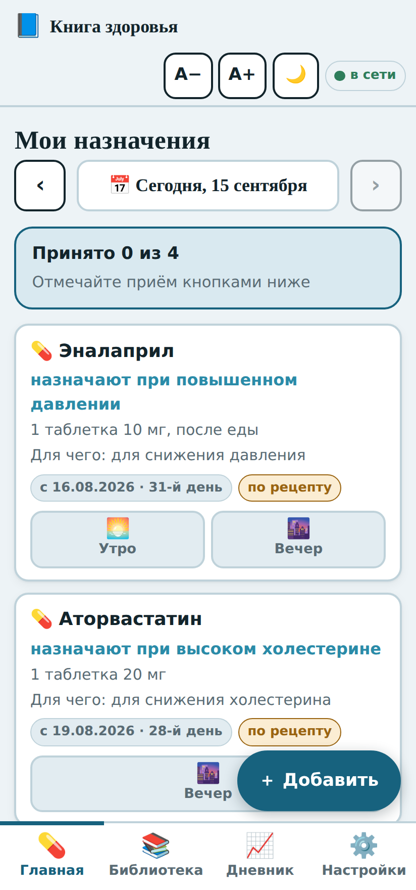 | 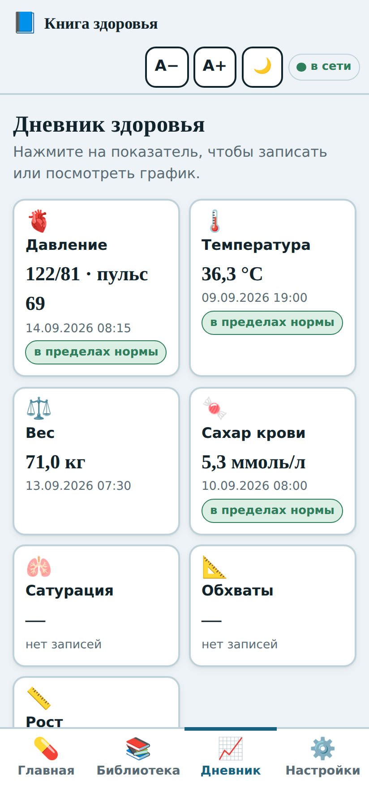 | 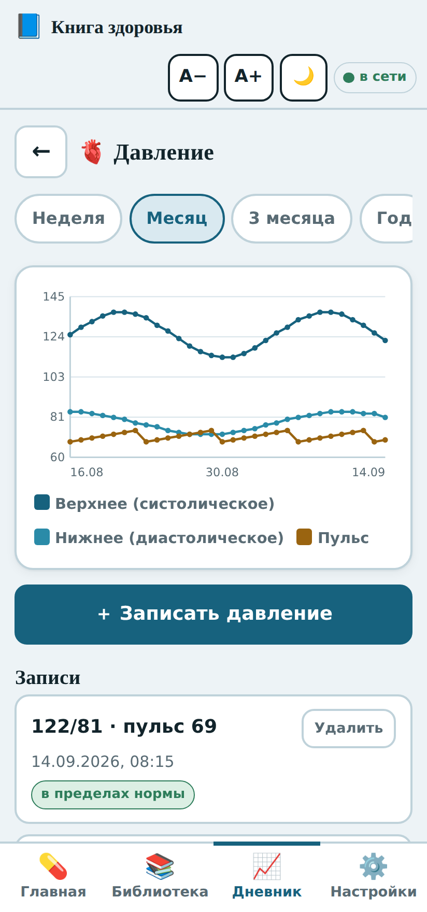 |
| Что принимать сегодня и отметки приёма | Показатели плитками, последнее значение на виду | Верхнее, нижнее и пульс на одном графике |

| Запись давления | Библиотека | Карточка лекарства |
| --- | --- | --- |
| 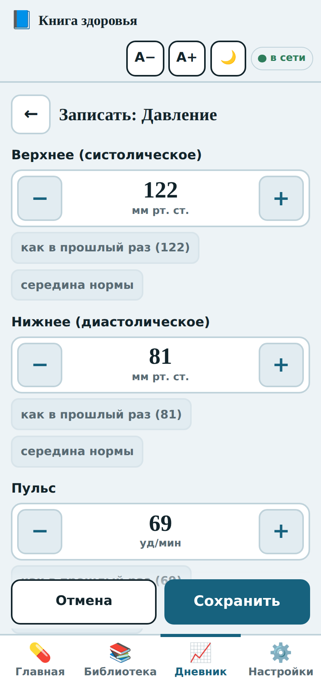 | 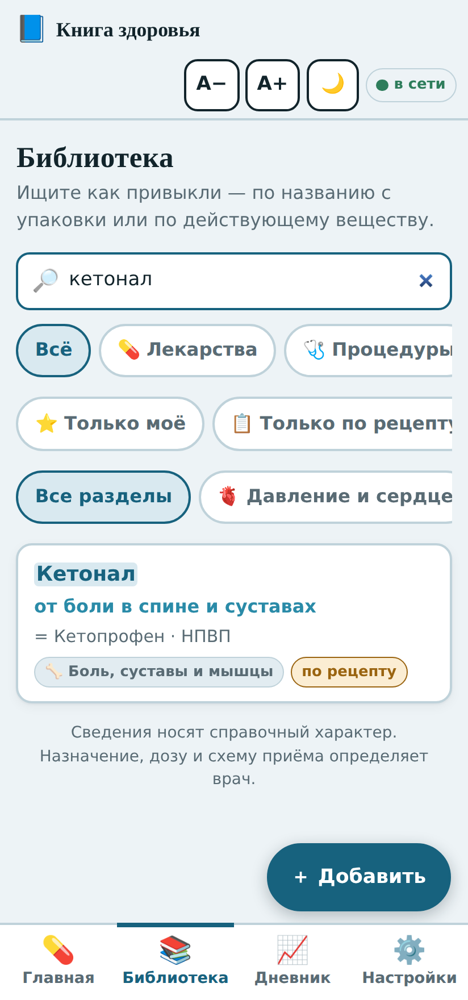 | 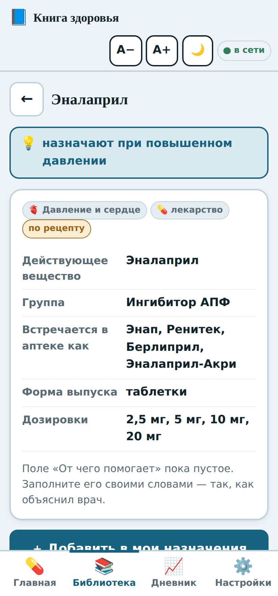 |
| Кнопки «−» и «+», а не клавиатура | Нашлось по названию с упаковки | Факты, справка, поиск в аптеках |

| Поиск с опечаткой | Календарь | Добавление назначения |
| --- | --- | --- |
| 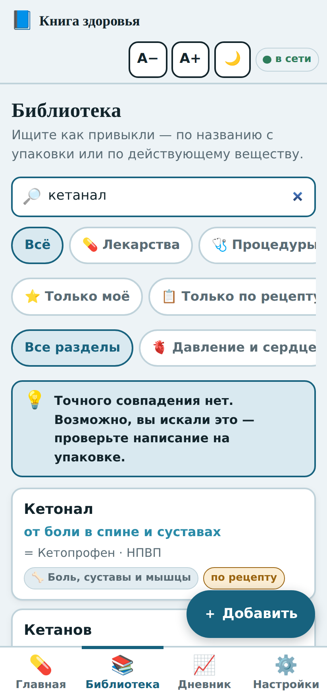 | 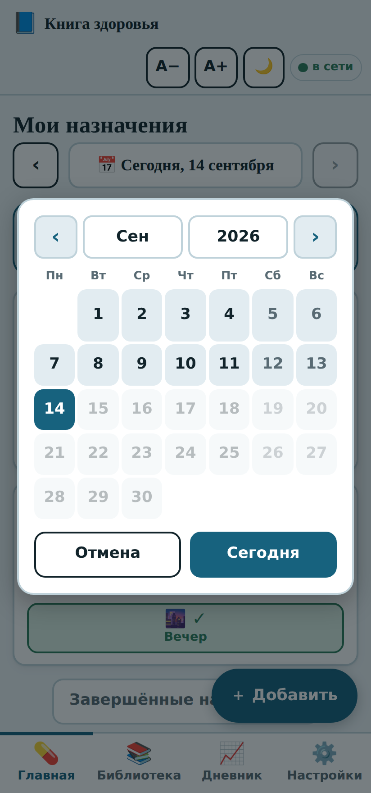 | 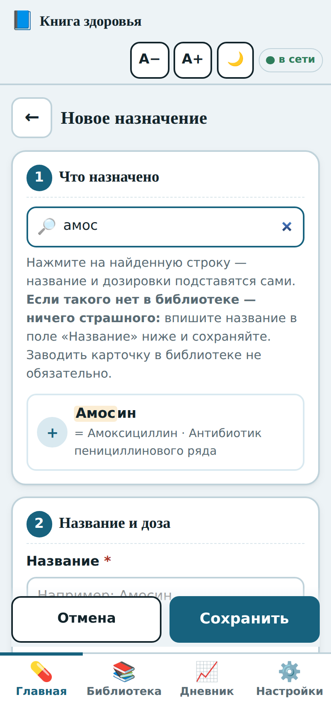 |
| «Кетанал» находит Кетонал | Крупные клетки, месяц и год отдельно | Шаг 1 — выбор из библиотеки |

| Новая позиция | Карточка назначения | Настройки |
| --- | --- | --- |
| 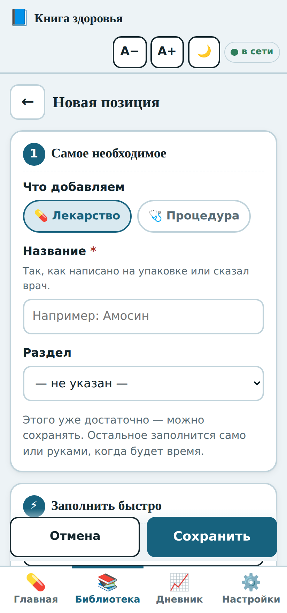 | 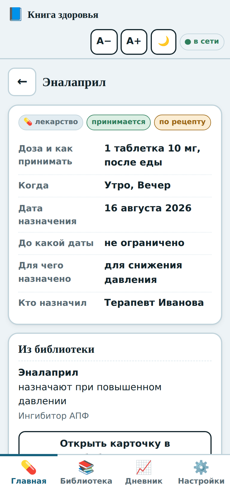 | 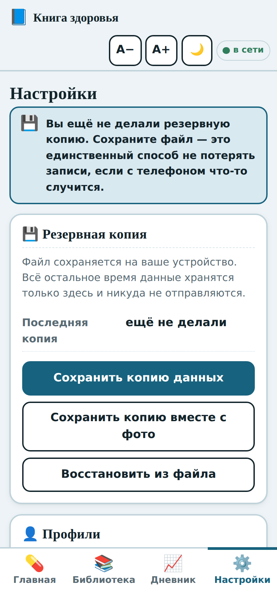 |
| Обязательно только название | Доза, схема, фото, история приёма | Копии, профили, место на устройстве |

| Поиск «от давления» | Набор лекарств | Ввод числа |
| --- | --- | --- |
| 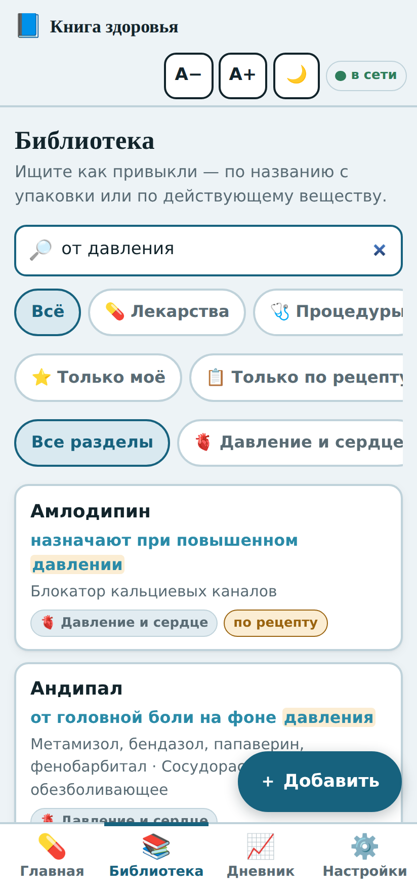 | 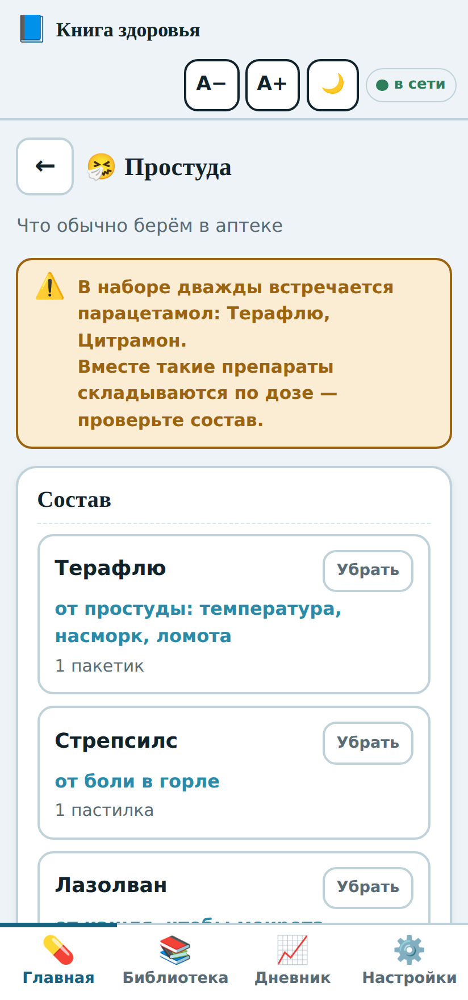 | 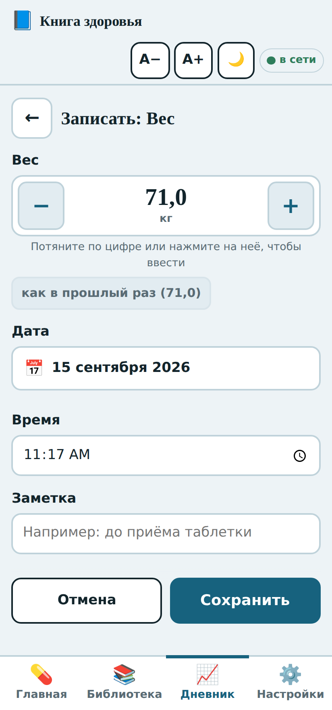 |
| Бытовая подпись ищется наравне с названием | Свои подборки и проверка на повтор вещества | Кнопки, протягивание пальцем или клавиатура |

| Отчёт для врача | Тёмная тема | Крупный шрифт |
| --- | --- | --- |
| 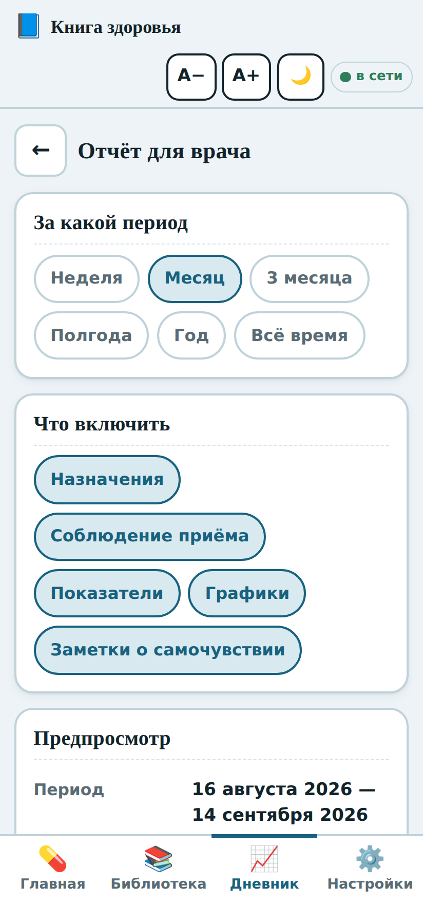 | 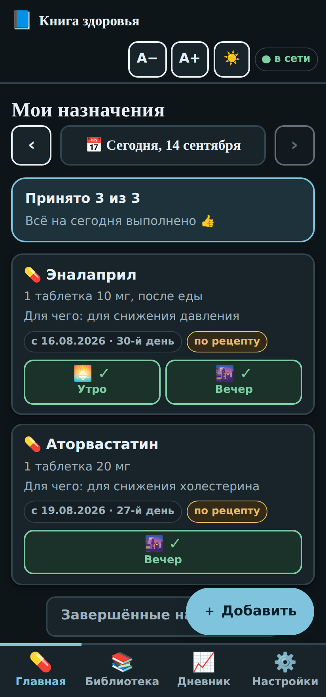 | 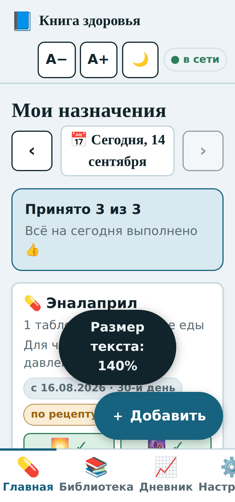 |
| Период и что включить в выписку | Переключается кнопкой вверху | Масштаб до 200% без потери чёткости |

Так выглядит сама выписка, которую можно распечатать или сохранить в PDF:

<p align="center">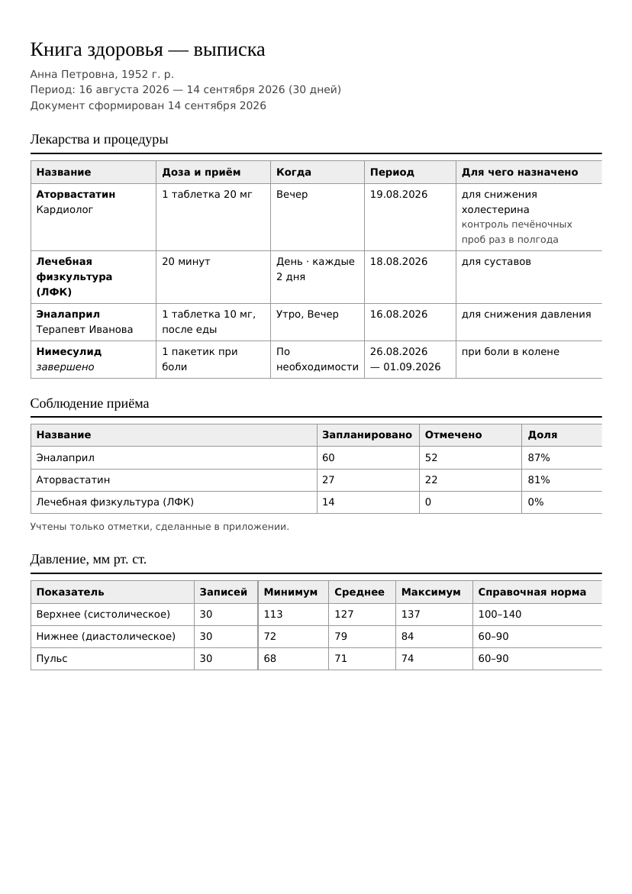</p>

---

## Требования

|            |                                                              |
| ---------- | ------------------------------------------------------------ |
| Телефон    | Android с браузером Chrome                                    |
| Компьютер  | Windows с Chrome или Edge                                     |
| Интернет   | нужен только при первом открытии, для обновлений, справки из Википедии и поиска в аптеках |
| Камера     | для снимков упаковки; работает по защищённому адресу (https), то есть на сайте, а не при открытии файла напрямую |

Браузер Chrome рекомендуется: в некоторых других (например, Яндекс.Браузере) поле
ввода и экранная клавиатура на телефоне ведут себя не лучшим образом. После установки
приложения через Chrome всё работает как надо.

---

## Установка

Приложение — это [PWA](https://ru.wikipedia.org/wiki/Progressive_Web_App): оно
открывается по ссылке как обычный сайт, а затем ставится на устройство своей иконкой
и дальше работает без интернета.

1. Открыть **[ссылку на приложение](https://zubakamaraka.github.io/health_book/)** в Chrome.
2. На Android: меню Chrome (⋮) → «Установить приложение» или «Добавить на главный экран».
   На Windows: значок установки в адресной строке или меню → «Установить».
3. На рабочем столе появится значок с синей книгой — дальше приложение открывается
   одним нажатием и работает офлайн.

Первое открытие обязательно с интернетом — приложение сохраняет само себя на устройство.
После этого сеть больше не нужна.

**Установить обязательно.** Установленное приложение браузер бережёт гораздо
аккуратнее: у открытой «просто вкладки» данные могут быть вычищены после долгого
простоя, у установленного приложения — нет.

---

## Данные и их сохранность

Записи хранятся **только на устройстве**, в хранилище браузера. Ни на какой сервер
ничего не уходит — сервера у приложения просто нет.

**Обновление приложения не стирает записи.** Данные и сама программа лежат в разных
местах браузера: программа — в кэше, записи — в отдельном хранилище. Обновление
подменяет только программу. Дополнительно у данных есть номер формата и цепочка
превращений: новая версия приложения не перезаписывает старые записи, а аккуратно
дочитывает их до нового вида, отложив перед этим страховочную копию.

Записи могут пропасть в трёх случаях, и каждый закрыт:

| Что может случиться | Что сделано |
| --- | --- |
| Очистка данных браузера, потеря или замена телефона | Резервная копия в файл — единственная настоящая защита. Приложение напоминает о ней, если копии не было больше месяца |
| Сменился адрес приложения | Для браузера другой адрес — другое хранилище. Поэтому адрес `…/health_book/` менять нельзя ни при каких обстоятельствах |
| Файл данных повредился | Приложение не затирает его пустышкой, а откладывает отдельно и предлагает выгрузить файлом |

Резервных копий две: **обычная** — маленький файл только с записями, для регулярного
сохранения; **полная** — вместе с фотографиями, для переезда на новый телефон.
Восстановление спрашивает подтверждение и перед заменой сохраняет то, что было, —
неудачное восстановление можно отменить там же, в настройках.

Фотографии сжимаются до примерно 200–300 КБ каждая. Несколько сотен снимков помещаются
без труда; сколько занято — видно в настройках, там же их можно удалять.

---

## О медицинской части — важное

**«Книга здоровья» — это дневник и картотека того, что назначил врач.** Не справочник
«что от чего принимать» и не советчик.

- Встроенная библиотека содержит только **факты**: название, действующее вещество,
  фармакологическую группу, формы выпуска, встречающиеся дозировки, отпуск по рецепту.
  Это не инструкция по применению и не рекомендация.
- Поле «Для чего назначено» заполняет сам пользователь — своими словами, со слов врача.
- Приложение **не ставит диагнозов** и не даёт заключений. Границы нормы на графиках
  приведены справочно, для ориентира, и у разных людей отличаются.
- Полный перечень показаний и противопоказаний всегда есть в инструкции к упаковке.

Приложение не является медицинским изделием.

---

## Почему справка тянется из Википедии, а не из аптечной базы

Короткий ответ: **браузер не даёт странице читать содержимое чужих сайтов.**

Это встроенное правило безопасности (Same-Origin Policy). Снять запрет может только
сам чужой сайт, прислав специальное разрешение в ответе. ГРЛС, РЛС, Видаль и сайты
аптечных сетей такого разрешения не присылают — и вдобавок закрыты защитой от
автоматических обращений: запрос к ним извне возвращает либо отказ, либо запрет в
`robots.txt`. Поэтому «умный разбор сайтов аптек» внутри приложения без сервера
невозможен в принципе, а с сервером — ломался бы при каждом изменении вёрстки.

Разрешение присылает **API Википедии**. Русская Википедия содержит статьи почти по всем
препаратам и действующим веществам, лицензия свободная (CC BY-SA), источник в карточке
подписан. Справка скачивается только по нажатию кнопки, сохраняется на устройстве и
дальше доступна офлайн. В репозитории чужих текстов нет.

Оговорка: у многих препаратов статья написана про действующее вещество или даже про
исходный организм — у «Энтерола» это дрожжи Saccharomyces boulardii. Приложение выбирает
статью по нескольким признакам, предупреждает, если текст не похож на описание лекарства,
и всегда предлагает кнопку **«Это не та статья — выбрать другую»**.

Кнопка **«Найти в аптеках»** открывает поиск по сайту нужной аптеки во внешнем браузере.
Это работает всегда и не ломается — в отличие от разбора страниц.

### Почему наборы свои, а не готовые «при гриппе — вот это»

Идея понятная: заболел — добавить сразу всё привычное, а не искать по одной позиции.
Но набор вида «при гриппе принимайте то-то» — это уже назначение лечения, а приложение
такого делать не должно. Для пожилого человека это особенно плохо: новые препараты
накладываются на постоянные, и дозы начинают складываться. Классический пример —
парацетамол, который есть и в Терафлю, и в Цитрамоне, и в Пенталгине: по отдельности
каждая упаковка безобидна, вместе легко выйти за суточную дозу.

Поэтому сделано так: **состав набора определяете вы или врач**, а приложение запоминает
его и добавляет одним нажатием. А чтобы та самая ловушка не сработала, добавлена
**проверка на повтор действующего вещества** — и в наборе, и на главном экране.
Она честно разбирает состав комбинированных препаратов и предупреждает:
«одно и то же вещество парацетамол сразу в нескольких позициях».

Для начала есть пустые заготовки с названиями — «Простуда», «Давление», «Желудок»,
«Аптечка в дорогу». Заготовка создаёт только название; что в неё положить, решаете вы.

### Что делать, если врач назвал лекарство, которого нет в библиотеке

Ничего особенного — и это главное. **Заводить карточку в библиотеке не обязательно.**
В форме назначения достаточно вписать название в поле «Название» и сохранить: получится
полноценное назначение с дозой, расписанием и отметками приёма. Если в поиске по
библиотеке ничего не нашлось, приложение прямо предлагает кнопку
**«Записать … как есть»**.

Когда карточку всё же хочется завести, есть три пути, от быстрого к подробному:

| Путь | Сколько занимает | Что получается |
| --- | --- | --- |
| Только название | секунды | Позиция появляется в библиотеке и находится поиском. Подробности можно дописать когда угодно |
| **«Взять за образец похожее»** | один поиск и одно нажатие | Раздел, действующее вещество, группа, формы выпуска и дозировки копируются из готовой позиции. Название остаётся вашим — так удобно заводить аналоги: «Долгит» по образцу ибупрофена |
| **«Заполнить из интернета»** | одно нажатие, нужен интернет | Из статьи Википедии вытаскиваются группа, формы выпуска, действующее вещество и фраза «для чего применяется», раздел определяется по ключевым словам. Всё попадает в поля как черновик — ничего не сохраняется само, видно и правится |

Из карточки назначения, записанного «как есть», всегда можно нажать
**«＋ Завести карточку в библиотеке»** — название подставится, а после сохранения
назначение свяжется с новой позицией.

Полностью автоматического заполнения «как в аптечной карточке» не будет по той же
причине, что и парсинга аптек: читать чужие сайты браузер странице не даёт, а
Википедия — единственный доступный источник, и она пишет про действующее вещество,
а не про упаковку.

### Почему нет сканирования штрихкода

На упаковках лекарств в России не QR, а **Data Matrix** системы «Честный знак». Прочитать
его технически можно, но код содержит только номер товара (GTIN), а не название. Чтобы
превратить номер в «Эналаприл 10 мг», нужна база соответствий: открытой бесплатной базы
нет, а API «Честного знака» требует регистрации и авторизации. То есть сканирование дало
бы строку `04607…` и ничего больше.

Вместо него ту же задачу — «быстро завести лекарство, не набирая всё руками» — решают
три вещи, которые не ломаются: **фотография упаковки и рецепта**, **поиск по встроенной
библиотеке** (набрали три буквы — все поля заполнились) и **поиск в аптеках** при наличии
интернета.

---

## Устройство проекта

```
index.html                каркас страницы
app.css                   оформление, палитра, тёмная тема, стили печати
data/library.json         встроенный словарь: 273 лекарства, 37 процедур, 600+ торговых названий
                          и бытовая подпись «от чего» у каждой позиции
js/store.js               данные, формат, превращения, хранилище фотографий
js/ui.js                  общие части интерфейса, адреса экранов, степперы
js/home.js                главная: назначения и отметки приёма
js/kits.js                свои наборы и проверка на повтор вещества
js/library.js             библиотека, свои позиции, Википедия, поиск в аптеках
js/diary.js               дневник, показатели, графики
js/report.js              отчёт для врача
js/settings.js            настройки, профили, резервные копии
sw.js                     офлайн-режим
manifest.webmanifest      описание приложения для установки
docs/make_icons.py        генератор иконок
docs/expand_library.py    пополнение словаря новыми позициями и названиями
docs/add_tldr.py          бытовые подписи «от чего»
```

Никакой сборки и никаких зависимостей: обычные HTML, CSS и JavaScript. Чтобы
посмотреть приложение локально, достаточно поднять любой статический сервер в папке
проекта (например, `python3 -m http.server`) и открыть адрес в браузере — при открытии
файла напрямую (`file://`) не работают ни офлайн-режим, ни камера.

Приложение само подтягивает свежую версию при наличии интернета: чистить кэш вручную
не нужно.

---

## Лицензия

MIT — можно пользоваться, копировать и переделывать под себя.

Встроенный словарь содержит только фактические сведения о лекарствах (названия,
действующие вещества, группы, формы выпуска, дозировки) и не воспроизводит чужих
текстов инструкций. Справка из Википедии загружается пользователем на своё устройство
и распространяется на условиях CC BY-SA с указанием источника.
